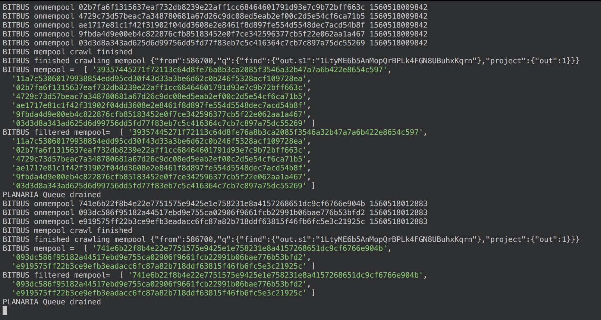
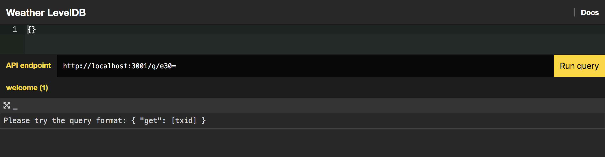
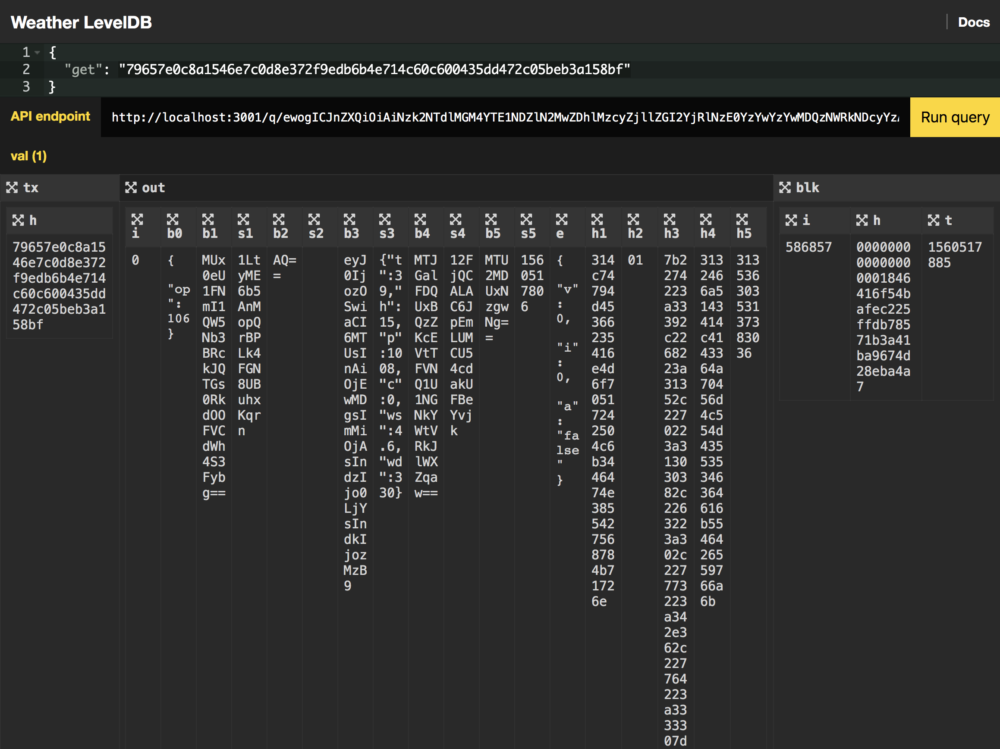

# Neon Planaria LevelDB

A simple LevelDB running on [Neon Planaria](https://neon.planaria.network)

# How to run

Step 1. Clone the project

```
git clone https://github.com/interplanaria/neonlevel.git
```

Step 2. Install dependencies

```
npm install
```

Step 3. Start Planaria

```
node index
```

You will see that, at first Bitbus starts synchronizing. And after that's done, Planaria will start synchronizing with Bitbus. 



> If you want to see the result faster, you may want to tweak the "from" attribute to start crawling from later height

Step 4. Start Planarium

After Planaria finishes synchronizing, open Planarium with:

```
node server
```

You will see a home page with "Open explorer" button. Click it, and you'll be welcomed with an empty explorer:



Try typing entering a query:

```
{
  "get": "79657e0c8a1546e7c0d8e372f9edb6b4e714c60c600435dd472c05beb3a158bf"
}
```

You'll see the result:



> Remember, YOU can design this query language yourself. And this demo code shows you how this is done.


# How it works

## Planaria (WRITE)

### 1. LevelDB

On the WRITE side (`index.js`), the app takes WeatherSV dataset and inserts them into LevelDB.

### 2. Only Output

This app only replicates the `output` of each relevant transaction through [bitbus](https://bitbus.network).


## Planarium (READ)

### 1. Interlevel

On READ side (`server.js`), the app accesses the stored LevelDB instance through a library called [Interlevel](https://github.com/interplanaria/interlevel).

This is needed because LevelDB on its own is not thread safe. Interlevel lets you set up a ZeroMQ server and send `get` and `put` queries over Zeromq and get response back through the same channel.

### 2. Default Query

It also utilizes the `default` attribute, which is the default JSON query that gets displayed when the explorer is opened for the first time.

